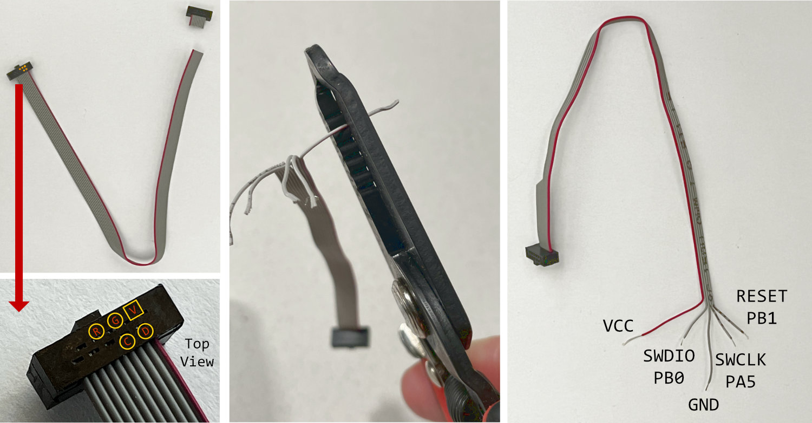
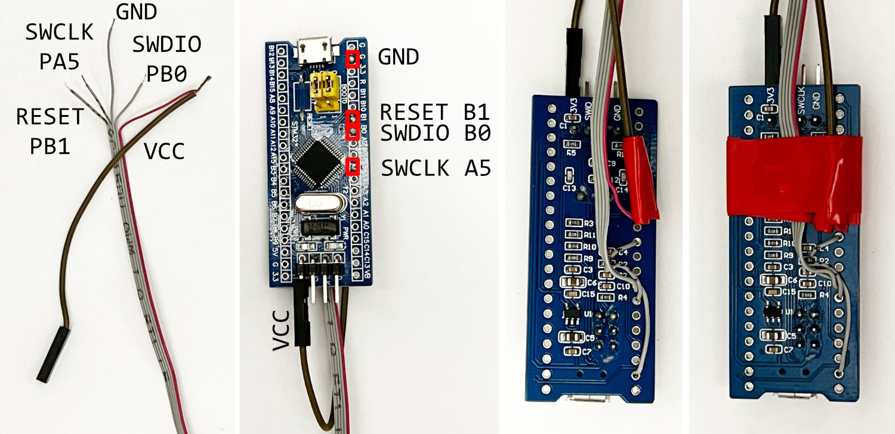
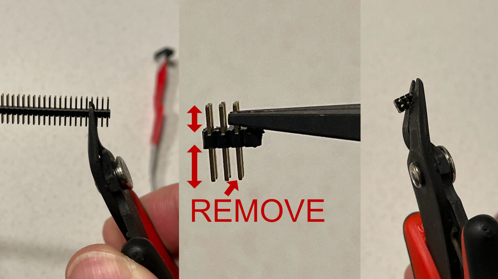
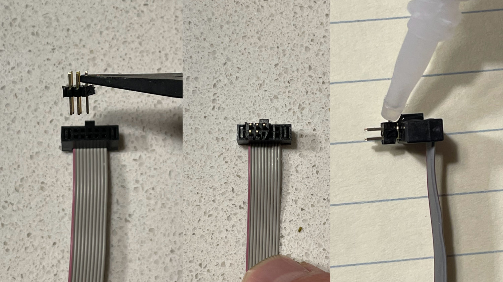
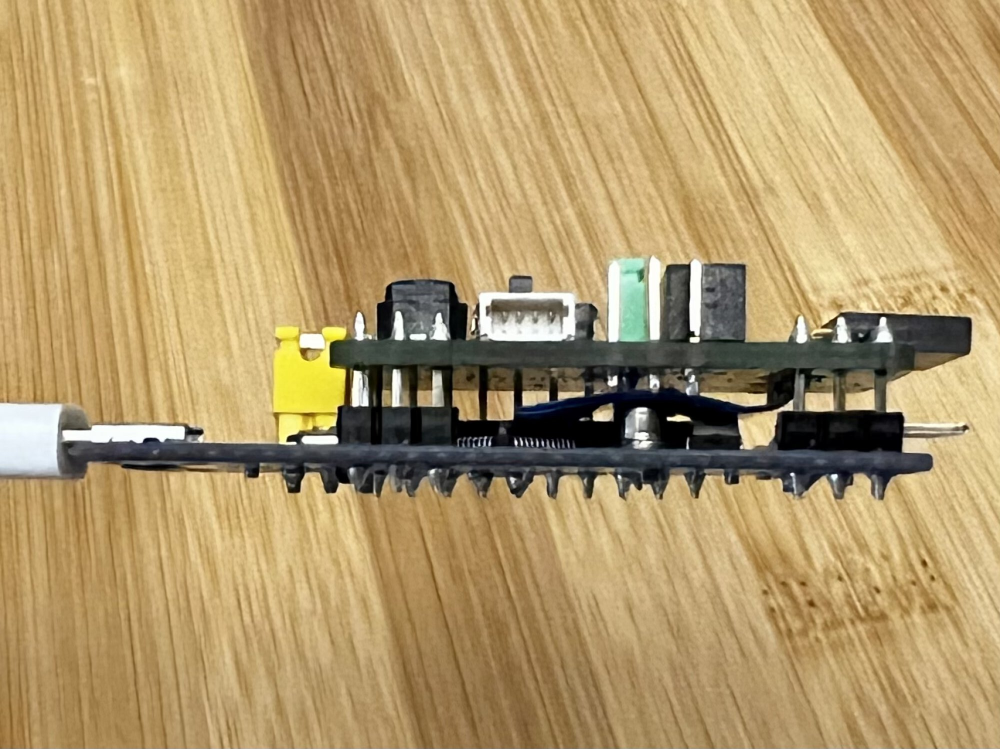

# BMP firmware for Bluepill

This repo contains instructions needed to turn a [Bluepill board](https://stm32-base.org/boards/STM32F103C8T6-Blue-Pill.html)
into a [Black Magic Probe](https://github.com/blacksphere/blackmagic/wiki) debugger.
Black Magic Probe (BMP) runs a GDB server on the debug probe itself which allows for programming and debugging.
I've had best luck with connecting to targets under periodic sleep with BMP compared to openocd or pyocd.

The `dist/` folders contains binary builds of the BMP firmware.
The following changes have been applied, compared to `PROBE_HOST=stlink` default configuration:
* the SWDIO pin has been moved from PB14 to PB0
* the LED pin has been moved to PC13 (where the LED is on the Bluepill)
* the probe will assert target RESET signal on boot; this way the Bluepill reset button will reset both the probe and the target
* the Vref can be connected to PA0 without voltage divider
* disable Debug-in-STOP-mode registers - these cause trouble in my experience; it's possible this is now fixed in upstream bluepill

The file `dist/blackmagic_all.bin` needs to be flashed at `0x08000000` (beginning of flash).
This can be done using STLINK/V2 hardware and the following command:

```
openocd -c 'set FLASH_SIZE 0x20000' -f interface/stlink-v2.cfg -f target/stm32f1x.cfg -c 'program dist/blackmagic_all.bin verify reset exit 0x08000000'
```

You can also just run `./flash.sh` which does the same.

Many Bluepill boards announce 64KB, which is not enough for BMP.
The command above force-configures flash size to be 128KB
(the STM32F103C8 parts typically have 128KB but the upper half may be defective or not tested).
The command also verifies if the flash was written correctly - in case you get an error there, get a different Bluepill.

You can also use some STLINK GUI application, or any other methods for flashing.

## Getting Bluepill board

These are easily available on Amazon, Ebay, Aliexpress, etc. Search for `STM32F103C8T6`.
If you don't have a ST-LINK/V2 (clone), then get one as well (they often come together with Bluepills),
so you can re-program your Bluepill.

## Pinout

The basic SWD pinout follows.

|Pin |Function| Comments
|----|--------| ------------
|PB0 |SWDIO   | Required
|PA5 |SWCLK   | Required
|PB1 |RESET   | Optional - can be connected to NRST line of target
|PA10|SWO     | Optional - SWO is for logging, but is rarely used
|PA0 |Vref    | Optional - prints out target voltage on startup
|PC13|LED     | LED already connected on the Bluepill

The Bluepill will also act as a USB-Serial adapter (on the higher-numbered serial port).

|Pin |Function|
|----|--------|
|PA3 |RX      |
|PA2 |TX      |

If you want to use JTAG, here are the connections (but I have not tested these).

|Pin |Function|
|----|--------|
|PB0 |TMS     |
|PA7 |TDI     |
|PA6 |TDO     |
|PA5 |TCK     |

## Hack-Connect XS cable

You can solder a Cortex-M debug cable (10 pin 0.05 inch pitch IDC cable; 8 or 6 pin will work as well)
to a Blue Pill directly and use [Hack-Connect-XS](https://arcade.makecode.com/hardware/dbg).



First cut one end of the cable (see picture above to determine which one) and split the first 5 wires.
Wire number 1 is red.
Strip isolation from the 5 wires, and cut away the remaining 5 wires.
Keep the GND and VCC wires about 15mm longer.



Next, connect a female jumper cable to VCC wire - you can either twist them together or solder (don't forget to isolate after connecting!).
You can later connect it to VCC pin of the Blue Pill (on its debug header) to power the target when needed.
Then solder the remaining wires to Blue Pill as indicated in the picture above.
Wrap the whole thing in electrical tape for cable strain relief.



Next, cut 6 pins from a 0.05 inch dual row male header.
You may want to cut 8 pins and remove the excessive pins (the plastic often breaks at the pin boundary).
Remove one pin, as indicated.
Finally, remove excessive plastic.



Now, insert the header into the connector, aligning the left side with the red wire.
There should be 3 pins on the outer edge and 2 on the inner.
You can test your cable now, before gluing - the header will likely stay in PCB when you pull out the cable, which is why we’re glueing.
After testing, pull out the header out slightly (around 1mm), put a drop of glue in the gap, and then press the connector back in.
Leave it to dry for a few minutes (it will stick to PCB if it doesn’t dry!).


## Bluepill-BMP shield

If you don't feel like breadboarding the pinout above,
the `eagle/` folder contains design files for a shield with 2x5pin 50mil Cortex debug connector,
a switch for powering the target, and a reset button for the target.
The Gerber files are also included.

It also lets you optionally use pin 5 of the Cortex debug connector as RESET line,
so you can use Hack-Connect-XS without any cable slicing - once you set the jumper into HC-XS position,
just use a regular 2x5pin IDC cable, with
[the male header inserted on target side](https://arcade.makecode.com/hardware/dbg#target-end).

(This shield is why I do not use the `swlink` BMP target)

Note that the `RX`/`TX` pins on the shield are meant to solder a header pointing away from the Bluepill
(see picture below).
You can connect an external serial port to it, and see it as one of the BMP serial ports.



## License

The Black Magic Probe firmware https://github.com/blacksphere/blackmagic
is licensed under GPL v3.
See https://github.com/mmoskal/blackmagic/tree/bluepill for the
[patches applied](https://github.com/blackmagic-debug/blackmagic/compare/main...mmoskal:blackmagic:bluepill);
to build use `make PROBE_HOST=stlink BLUEPILL=1`

The Eagle files contain parts based on ones from 
* SparkFun Eagle Libraries https://github.com/sparkfun/SparkFun-Eagle-Libraries licensed under CC-SA-4.0
* Adafruit Eagle Libraries https://github.com/adafruit/Adafruit-Eagle-Library

Any new content is licensed under MIT.
